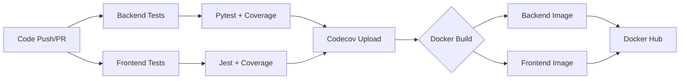

# CI/CD Playground


✅ **CI/CD pipeline working!**

A hands-on project demonstrating CI/CD pipeline implementation with GitHub Actions.

## 📊 Quick Stats

| Metric | Count |
|--------|-------|
| **Total Tests** | 7 (5 backend + 2 frontend) |
| **API Endpoints** | 4 |
| **CI/CD Jobs** | 3 |
| **Docker Images** | 2 |
| **Test Frameworks** | 2 (Pytest, Jest) |
| **Coverage Tracking** | ✅ Codecov |
| **Languages** | Python, JavaScript |

## 🎯 What This Project Does

This project demonstrates a complete CI/CD pipeline implementation using GitHub Actions. It showcases automated testing, code coverage tracking, and Docker containerization for both a Python Flask backend and a React frontend.

### Pipeline Flow



### How It Works

1. **Trigger**: The pipeline automatically runs on every push to `main` or `develop` branches, and on pull requests targeting these branches.

2. **Parallel Testing**: 
   - **Backend Tests**: Runs Pytest with code coverage, testing all Flask API endpoints
   - **Frontend Tests**: Runs Jest with React Testing Library, verifying UI components

3. **Coverage Reporting**: Both test suites upload coverage reports to Codecov for tracking test coverage over time.

4. **Docker Build**: Only after all tests pass, the pipeline builds and pushes Docker images for both backend and frontend to Docker Hub.

5. **Status Monitoring**: The pipeline badge at the top of this README shows the current build status in real-time.

This setup ensures code quality through automated testing before any deployment, demonstrating best practices for continuous integration and deployment workflows.

## What This Project Demonstrates

**CI/CD Skills:**
- ✅ GitHub Actions workflow creation
- ✅ Automated testing (Pytest + Jest)
- ✅ Multi-job pipeline configuration
- ✅ Backend and frontend integration
- ✅ Build status monitoring

## Tech Stack

- **Backend**: Python Flask
- **Frontend**: React
- **CI/CD**: GitHub Actions
- **Testing**: Pytest (Backend), Jest (Frontend)

## Pipeline Status

- Backend Tests: ✅ Passing
- Frontend Tests: ✅ Passing

## Local Development

**Backend:**
```bash
cd backend
pip install -r requirements.txt
python app/main.py
```

**Frontend:**
```bash
cd frontend
npm install
npm start
```

## 🐳 Docker Usage

### Quick Start with Docker Compose

The easiest way to run the entire application:

```bash
docker-compose up --build
```

This will:
- Build both backend and frontend Docker images
- Start both services
- Backend available at `http://localhost:5100`
- Frontend available at `http://localhost:3000`

To run in detached mode (background):
```bash
docker-compose up -d --build
```

To stop the services:
```bash
docker-compose down
```

### Building Individual Containers

**Backend:**
```bash
cd backend
docker build -t ci-cd-backend .
docker run -p 5100:5000 -e ENVIRONMENT=development ci-cd-backend
```

**Frontend:**
```bash
cd frontend
docker build -t ci-cd-frontend .
docker run -p 3000:3000 -e REACT_APP_API_URL=http://localhost:5100 ci-cd-frontend
```

### Using Pre-built Images from Docker Hub

If images are available on Docker Hub:
```bash
docker pull <your-docker-username>/ci-cd-backend:latest
docker pull <your-docker-username>/ci-cd-frontend:latest
```

## CI/CD Pipeline

The pipeline automatically:
1. Runs on every push to main
2. Tests backend with Pytest
3. Tests frontend with Jest
4. Reports build status via badge

**Green badge = All tests passing!** 🎉

## 🔧 Troubleshooting

### Port Conflicts

**Issue**: Port 5100 or 3000 is already in use.

**Solution**:
```bash
# Check what's using the port
lsof -i :5100  # macOS/Linux
netstat -ano | findstr :5100  # Windows

# Kill the process or change the port in docker-compose.yml
```

### Backend Not Starting

**Issue**: Flask app fails to start or shows import errors.

**Solutions**:
- Ensure you're in the correct directory: `cd backend`
- Verify Python version: `python --version` (should be 3.11+)
- Reinstall dependencies: `pip install -r requirements.txt --force-reinstall`
- Check virtual environment is activated (if using one)

### Frontend Can't Connect to Backend

**Issue**: Frontend shows "Loading..." indefinitely or network errors.

**Solutions**:
- Verify backend is running: `curl http://localhost:5100/health`
- Check `REACT_APP_API_URL` environment variable matches backend URL
- Ensure CORS is enabled in Flask (already configured in this project)
- If using Docker, ensure both containers are on the same network

### Docker Build Failures

**Issue**: `docker build` fails with dependency errors.

**Solutions**:
- Clear Docker cache: `docker system prune -a`
- Rebuild without cache: `docker-compose build --no-cache`
- Check Dockerfile syntax and file paths
- Verify all required files are present (requirements.txt, package.json, etc.)

### Test Failures

**Backend Tests Failing**:
```bash
cd backend
# Run tests with verbose output
pytest tests/ -v
# Check for missing dependencies
pip install -r requirements.txt
```

**Frontend Tests Failing**:
```bash
cd frontend
# Clear node_modules and reinstall
rm -rf node_modules package-lock.json
npm install
# Run tests
npm test
```

### CI/CD Pipeline Issues

**Issue**: GitHub Actions workflow fails.

**Solutions**:
- Check workflow logs in GitHub Actions tab
- Verify secrets are configured (DOCKER_USERNAME, DOCKER_TOKEN)
- Ensure workflow file syntax is correct (`.github/workflows/ci.yml`)
- Check branch names match workflow triggers (main, develop)

### Dependency Installation Issues

**Python**:
```bash
# Use virtual environment
python -m venv venv
source venv/bin/activate  # macOS/Linux
venv\Scripts\activate  # Windows
pip install -r requirements.txt
```

**Node.js**:
```bash
# Clear npm cache
npm cache clean --force
# Remove node_modules and reinstall
rm -rf node_modules package-lock.json
npm install
```

### Docker Compose Issues

**Issue**: Services won't start or connect.

**Solutions**:
```bash
# Stop and remove all containers
docker-compose down -v

# Rebuild and start fresh
docker-compose up --build --force-recreate

# Check container logs
docker-compose logs backend
docker-compose logs frontend
```

### Environment Variables Not Working

**Issue**: Environment variables aren't being picked up.

**Solutions**:
- For local development, ensure variables are set before starting services
- For Docker, check `docker-compose.yml` environment section
- For React, ensure variables start with `REACT_APP_` prefix
- Restart services after changing environment variables

### Still Having Issues?

- Check that all prerequisites are installed (Python 3.11+, Node.js 18+, Docker)
- Verify file permissions are correct
- Review error messages in terminal/logs for specific error details
- Ensure you're using the correct branch (main or develop)
